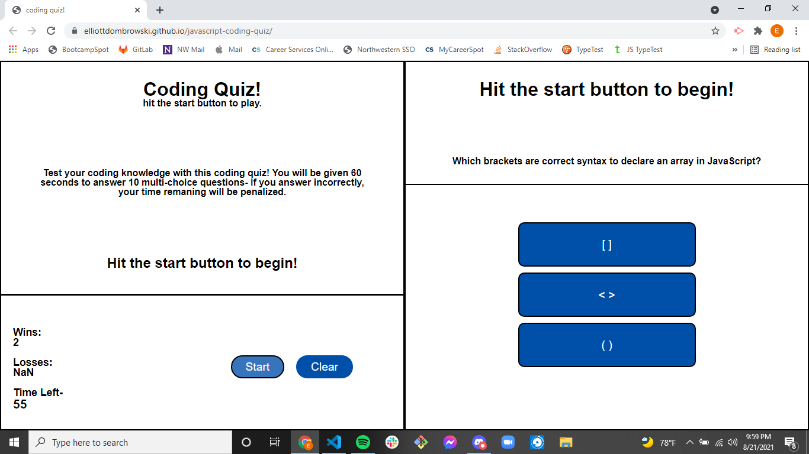

# javascript-coding-quiz
Coding quiz minigame built with javascript.

# This is a 10 question coding quiz written with Javascript, HTML, and CSS.
The user is provided a brief paragraph with instructions on how to play, and prompted to click the "start" button.
The user is also provided with a "clear" button to reset scores saved in local storage.

When the start button is clicked, the user will be provided with a countdown timer, a question, and three buttons with choices to answer.

If the user selects the correct answer, the current question will be cleared and a new question will be displayed with new answer choices.
If the user selects the incorrect answer, the question will remain onscreen until answered correctly and 3 seconds will be decremented from the countdown timer for each incorrect answer.

If the user correctly answers all 10 questions, they will be provided an input field to log and save their high score.

If the user's countdown timer decrements to 0, the page will be wiped and the user must click "start" to play again.

# Link to deployed page-
https://elliottdombrowski.github.io/javascript-coding-quiz/

# Notes
There's issues here. I think I completed the bulk of it, but there's minor fixes that I'm just out of time to fix- such as more aesthetically appealing styling, media queries and layout bug fixes.